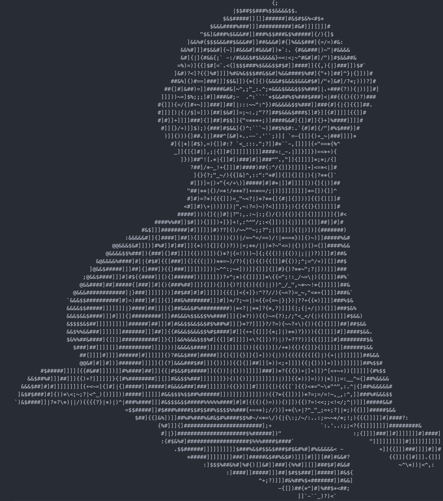

## Image to Ascii Art

A fun little program that turns a given image into ASCII Art 

##### Input 

##### Output 

### Running

##### `python generate_char_set.py [<-a>]`

Generates a character set from the Consolas font, mapping all 255 pixel intensisties to characters. 
The generated character set is then written to `./resources/char_set.txt`

The character set by default only uses non-alphanumeric ascii characters. 

The `-a` or all flag generates a character set from all printable ascii characters 

##### `python image_to_ascii.py <input_image> [<compression_amount>] [<-s> <-l>]`

Creates ascii art from the given image and character set, using the given compression amount, with a default compression of 12 pixels to 1 character. 

Character output is dark mode friendly by default

The accepted flags are:

* `-s` performs smoothing on the output photo, less contrast 

* `-l` light mode friendly output 
